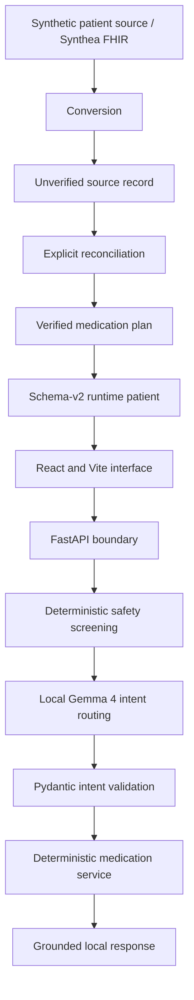

# Medication Copilot

Medication Copilot is a privacy-first, local medication-navigation and adherence-support prototype for older adults and caregivers. It helps a user inspect a verified schedule, look up the next dose, review recorded adherence, and safely record a dose as taken.

It does **not** diagnose, prescribe, recommend treatment, check interactions, or change dosages. It is a synthetic-data prototype, not a medical device.

## Motivation

Managing several medicines can make it difficult to remember what is scheduled and whether a dose was already taken. Medication Copilot explores a deliberately narrow approach: natural-language navigation over a locally stored, human-reconciled medication plan, with deterministic safety and readiness controls around every patient-facing action.

## Architecture



The repeatable live demo uses curated synthetic runtime data. Synthea FHIR ingestion remains supported, but imported orders stay in an unverified source-record layer. They cannot drive reminders or adherence answers until an explicit reconciliation profile creates a verified plan. Gemma routes language into approved actions; it is never the source of medication facts.

See [Architecture](docs/architecture.md) for the detailed request, persistence, and safety flows.

## Current features

- Local Gemma intent routing through Ollama
- Curated, verified medication plans and deterministic medication resolution
- Today's schedule, next-dose, dose-status, saved-instruction, and history lookup
- Idempotent mark-taken workflow with ambiguity blocking
- Ready/unready patient enforcement
- Deterministic medication-safety refusals
- Ready and review-required synthetic demo patients
- React and Vite interface with source review, health, and debug information
- Local FastAPI boundary with structured dashboard responses
- Explicit confirmation of an exact scheduled dose before adherence mutation
- Reproducible demo reset and verification commands
- Supported Synthea FHIR conversion and reconciliation pipeline

Production reminders, voice, image scanning, hospital integration, and native mobile deployment are not implemented.

## Setup

Python 3.10 or newer and Node.js 20.19 or newer are supported.

```bash
python -m venv .venv
source .venv/bin/activate
python -m pip install --upgrade pip
python -m pip install -r requirements.txt
cd frontend
npm install
npm run build
cd ..
```

Install and start [Ollama](https://ollama.com/), then pull the configured local model:

```bash
ollama pull gemma4:e2b
```

The defaults can be overridden with `OLLAMA_BASE_URL`, `OLLAMA_MODEL`, and `OLLAMA_TIMEOUT_SECONDS`. The demo remains verifiable without Ollama; only natural-language routing is unavailable.

Prepare and verify the demo:

```bash
python app.py reset-demo
python app.py verify-demo
python app.py verify-demo --require-model  # strict local-model check
```

For reproducible dates and dose state:

```bash
export DEMO_NOW="2026-08-01T10:00:00-04:00"
python app.py verify-demo
```

`DEMO_NOW` must include a timezone offset.

## Demo

```bash
python app.py reset-demo
python app.py verify-demo
python app.py serve
```

Open `http://127.0.0.1:7860`. The server binds to localhost only. A five-minute walkthrough and offline fallback are in [Demo script](docs/demo_script.md).

For frontend development, run the API and Vite development servers in separate terminals:

```bash
python app.py serve-api
cd frontend && npm run dev
```

Open `http://127.0.0.1:5173`; Vite proxies `/api` requests to the local Python server.

Useful CLI checks include:

```bash
python app.py list-patients
python app.py patient-status demo-ready-001
python app.py health
python app.py ask --patient demo-ready-001 "What medicine comes next?"
```

The legacy deterministic commands and pipeline commands remain available; run `python app.py --help` for the complete list.

## Testing

The standard suite does not require Ollama:

```bash
pytest -m "not integration"
python -m compileall -q app.py medication gemma ui scripts evaluation
cd frontend && npm run build
git diff --check
```

Live-model verification is intentionally separate:

```bash
python app.py verify-demo --require-model
```

## Screenshots

> Screenshot placeholder — ready-patient medication copilot view.

> Screenshot placeholder — review-required patient and isolated source-order view.

## Safety and privacy

- All included patient records are synthetic.
- The LLM runs locally through Ollama; no cloud LLM is configured.
- Patient-facing actions use only confirmed medicines, verified schedules, and app/simulated dose logs.
- Raw FHIR orders remain isolated for review and do not become a daily plan automatically.
- Missing allergy data means `not_recorded`, never “no allergies.”
- Gemma selects an approved action but cannot invent facts, resolve medication ambiguity, bypass readiness, or authorize unsafe advice.

The permanent safety and data specification is [rules.md](rules.md).

## Documentation

- [Architecture](docs/architecture.md)
- [Roadmap](docs/roadmap.md)
- [Demo script](docs/demo_script.md)
- [Contributing](CONTRIBUTING.md)

## Future work

These capabilities are planned, not implemented:

- Voice input and output
- Image/document input with human verification
- Native Android deployment
- Healthcare-system integration
