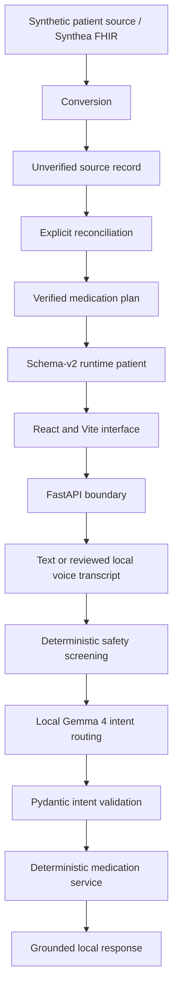

# Medication Copilot

Medication Copilot is a privacy-first, local medication-navigation and adherence-support prototype for older adults and caregivers. It helps a user inspect a verified schedule, look up the next dose, review recorded adherence, and safely record a dose as taken.

It does **not** diagnose, prescribe, recommend treatment, check interactions, or change dosages. It is a synthetic-data prototype, not a medical device.

## Motivation

Managing several medicines can make it difficult to remember what is scheduled and whether a dose was already taken. Medication Copilot explores a deliberately narrow approach: natural-language navigation over a locally stored, human-reconciled medication plan, with deterministic safety and readiness controls around every patient-facing action.

## Architecture



The repeatable live demo uses curated synthetic runtime data. Synthea FHIR ingestion remains supported, but imported orders stay in an unverified source-record layer. They cannot drive reminders or adherence answers until an explicit reconciliation profile creates a verified plan. Gemma routes language into approved actions; it is never the source of medication facts.

See [Architecture](docs/architecture.md) for the detailed request, persistence, and safety flows.

## Current features

- Local Gemma intent routing through Ollama
- Curated, verified medication plans and deterministic medication resolution
- Today's schedule, next-dose, dose-status, saved-instruction, and history lookup
- Canonical time-aware due/missed status and record-based missed-dose follow-up
- Idempotent mark-taken workflow with ambiguity blocking
- Ready/unready patient enforcement
- Deterministic medication-safety refusals
- Ready and review-required synthetic demo patients
- React and Vite interface with source review, health, and debug information
- Local FastAPI boundary with structured dashboard responses
- Explicit confirmation of an exact scheduled dose before adherence mutation
- Browser-verified on-device dictation with visible review before submission
- Optional verified medication-appearance descriptions as a local memory aid
- Reproducible demo reset and verification commands
- Supported Synthea FHIR conversion and reconciliation pipeline

Production reminders, image scanning, hospital integration, native mobile deployment, and spoken output are not implemented.

The ready synthetic demo includes curated appearance descriptions with reconciliation provenance. Only verified descriptions are displayed, and records without appearance remain valid. Appearance can vary by manufacturer or refill, so users should check the prescription label if a medicine looks different. Appearance is never used to identify or automatically resolve a medication, and no image recognition or external drug lookup is implemented.

## Setup

Python 3.10 or newer and Node.js 20.19 or newer are supported.

```bash
python -m venv .venv
source .venv/bin/activate
python -m pip install --upgrade pip
python -m pip install -r requirements.txt
cd frontend
npm install
npm run build
cd ..
```

Install and start [Ollama](https://ollama.com/), then pull the configured local model:

```bash
ollama pull gemma4:e2b
```

The defaults can be overridden with `OLLAMA_BASE_URL`, `OLLAMA_MODEL`, and `OLLAMA_TIMEOUT_SECONDS`. The demo remains verifiable without Ollama; only natural-language routing is unavailable.

Prepare and verify the demo:

```bash
python app.py reset-demo
python app.py verify-demo
python app.py verify-demo --require-model  # strict local-model check
```

For reproducible dates and dose state:

```bash
export DEMO_NOW="2026-08-01T10:00:00-04:00"
python app.py verify-demo
```

`DEMO_NOW` must include a timezone offset.

Dose display timing is controlled by `DOSE_DUE_WINDOW_MINUTES` (default `15`) and `DOSE_MISSED_AFTER_MINUTES` (default `30`). These are non-clinical application-display policies. Stored scheduled-dose state is preserved; `upcoming`, `due`, and `missed` are derived consistently at query time from the injected clock. “Missed” means only that no taken record exists after the configured threshold.

## Demo

```bash
python app.py reset-demo
python app.py verify-demo
python app.py serve
```

Open `http://127.0.0.1:7860`. The server binds to localhost only. A five-minute walkthrough and offline fallback are in [Demo script](docs/demo_script.md).

For frontend development, run the API and Vite development servers in separate terminals:

```bash
python app.py serve-api
cd frontend && npm run dev
```

Open `http://127.0.0.1:5173`; Vite proxies `/api` requests to the local Python server.

Useful CLI checks include:

```bash
python app.py list-patients
python app.py patient-status demo-ready-001
python app.py health
python app.py voice-health  # live local audio capability/transcription probe
python app.py ask --patient demo-ready-001 "What medicine comes next?"
```

The legacy deterministic commands and pipeline commands remain available; run `python app.py --help` for the complete list.

## Testing

The standard suite does not require Ollama:

```bash
pytest -m "not integration"
python -m compileall -q app.py medication gemma ui scripts evaluation voice
cd frontend && npm run build
git diff --check
```

Live-model verification is intentionally separate:

```bash
python app.py verify-demo --require-model
```

## Screenshots

> Screenshot placeholder — ready-patient medication copilot view.

> Screenshot placeholder — review-required patient and isolated source-order view.

## Safety and privacy

- All included patient records are synthetic.
- The LLM runs locally through Ollama; no cloud LLM is configured.
- Patient-facing actions use only confirmed medicines, verified schedules, and app/simulated dose logs.
- Raw FHIR orders remain isolated for review and do not become a daily plan automatically.
- Missing allergy data means `not_recorded`, never “no allergies.”
- Gemma selects an approved action but cannot invent facts, resolve medication ambiguity, bypass readiness, or authorize unsafe advice.
- Browser dictation is limited to 30 seconds, is enabled only when on-device recognition can be verified, and places an editable transcript in the question field without submitting it. The separate Python voice provider deletes normalized temporary audio after transcription. Neither path adds audio or transcript-review state to patient JSON.
- Appearance metadata stays local and remains secondary to exact medication name, strength, schedule, and dose-ledger facts.
- The deterministic follow-up service can stage a five-minute confirmation for one uniquely identified overdue dose. Contextual confirmation records only that exact revalidated dose; a bare “yes” without pending state never changes data. The app does not advise whether an overdue dose should be taken.

## Local voice compatibility

The React interface uses the browser's on-device speech-recognition mode. It enables the microphone only when local processing can be verified and otherwise offers local `.txt` or `.vtt` transcript loading. The transcript remains editable and requires an explicit **Ask** action.

Separately, the Python voice provider is backed by the configured `gemma4:e2b`. For Ollama 0.32.4, the verified local transport is a mono 16 kHz PCM WAV carried through Ollama's multimodal `images` compatibility field; the native `audios` field was observed to be ignored. `python app.py voice-health` generates a harmless English speech sample, sends no patient data, and accepts support only when returned words match the sample. A model capability flag or HTTP 200 alone is not considered success. The only currently tested language is English. No cloud speech provider, audio-upload web endpoint, or TTS is implemented.

The permanent safety and data specification is [rules.md](rules.md).

## Documentation

- [Architecture](docs/architecture.md)
- [Roadmap](docs/roadmap.md)
- [Demo script](docs/demo_script.md)
- [Contributing](CONTRIBUTING.md)

## Future work

These capabilities are planned, not implemented:

- Additional voice languages and spoken output
- Image/document input with human verification
- Native Android deployment
- Healthcare-system integration
