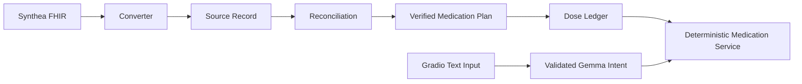

# MediCopilot

MediCopilot is an offline, synthetic-data medication navigation and adherence-support demo. It uses local Gemma E2B only to classify text into approved actions. Medication facts, readiness, schedules, resolution, allergy meaning, and dose history come from validated local data and deterministic Python services.

It is not a diagnostic, prescribing, interaction-checking, treatment, or dose-adjustment system. Unsafe requests receive a deterministic refusal, and emergency language receives an escalation message.

## Integrated architecture



The runtime flow is:

```text
User text
  -> deterministic safety screening
  -> local Gemma structured intent
  -> Pydantic validation
  -> deterministic readiness check
  -> deterministic medication resolver
  -> exactly one deterministic service operation
  -> deterministic grounded response
```

Intent `confidence` is optional diagnostic metadata (`null`, missing, or a
number from 0.0 through 1.0). It is never used to authorize a tool, resolve a
medicine, determine readiness, or change safety behavior. Invalid model output
gets one bounded repair containing the concrete validation error; a failed
repair produces a deterministic no-action response with details confined to
debug output.

Removing Gemma reduces natural-language convenience but does not change medication facts or state.

## Data boundaries

Runtime files use schema version `2.0`:

```json
{
  "schema_version": "2.0",
  "source_record": {
    "patient": {},
    "conditions": {},
    "allergies": [],
    "allergy_status": "not_recorded",
    "medications": [],
    "clinical_administrations": [],
    "provenance": {}
  },
  "medication_plan": {
    "patient_id": "...",
    "status": "verified",
    "medications": []
  },
  "dose_logs": [],
  "import_summary": {
    "ready_for_medication_tracking": true,
    "blocking_issues": [],
    "warnings": []
  }
}
```

- `source_record.medications` preserves imported FHIR orders for review. An active FHIR status never means confirmed current use.
- `medication_plan.medications` contains explicit reconciliation decisions and verified schedules.
- `dose_logs` contains app events or explicitly seeded synthetic events only. Clinical `MedicationAdministration` remains separate.
- Unsupported schema versions and invalid cross-field combinations are rejected by the patient-data service.

The patient-facing repository exposes confirmed medicines, verified schedules, app/synthetic dose logs, and allergy status. Source orders are available through a separate read-only review method and never enter medication resolution or daily answers.

## Reconciliation and readiness

Imported medicines begin `unverified`, excluded from the daily plan, and marked for review. A separate reconciliation profile can confirm current use, provide aliases, and add verified synthetic reminder times with provenance. It never overwrites the source instruction.

Reminder and adherence actions are blocked unless `import_summary.ready_for_medication_tracking` is true. Readiness is calculated deterministically and requires confirmed medicines, verified schedules, a timezone, and no blocking conflicts affecting included medicines.

PRN medicines cannot have recurring reminders. Frequency-only FHIR instructions never become clock times. Missing allergy resources mean `not_recorded`, not “no allergies.”

## Curated demo data

Generate the ready and unready runtime patients from the documented reconciliation profiles:

```bash
python scripts/prepare_demo_data.py
```

This creates:

- Elena Rivera: ready, three confirmed medicines, verified schedules, alias resolution, and deterministic dose history.
- Marcus Chen: review-only, unreconciled conflicting source orders, and no usable reminder plan.

Profiles are stored under `data/reconciliation/`; runtime files are under `data/runtime_patients/`.

## CLI

Set a reproducible demo time when desired:

```bash
export DEMO_NOW=2026-08-01T10:00:00-04:00
```

`DEMO_NOW` must be timezone-aware. The same injected clock controls CLI and
Gradio runtime services. “Today” filters dose instances to that exact local
date; if none exist, the app reports no data and never substitutes another day.

List and inspect runtime patients:

```bash
python app.py list-patients
python app.py patient-status demo-ready-001
python app.py health
```

Ask through the integrated orchestrator:

```bash
python app.py ask --patient demo-ready-001 "What medicine comes next?"
python app.py ask --patient demo-ready-001 "Did I take my heart tablet this morning?"
```

The existing legacy deterministic commands and safe pipeline commands remain available, including `today`, `status`, `next`, `mark-taken`, `instructions`, `history`, `convert-fhir`, `reconcile-patient`, `build-plan`, `generate-dose-logs`, `validate-patient`, and `readiness`.

## Gradio

Start Ollama locally and ensure the configured model exists, then run:

```bash
python app.py serve
```

Open `http://127.0.0.1:7860`. Public sharing is disabled. The application includes:

- session-specific patient selection;
- patient readiness and allergy status;
- confirmed medicines scheduled today;
- text-based intent routing;
- recent app/synthetic dose history;
- isolated read-only source-order review;
- collapsed debug metadata without hidden reasoning;
- combined local-model and patient-data health.

If Ollama is unavailable, deterministic patient and review data still load. The ask panel displays a local-model error instead of crashing.

## Health checks

`python app.py health` reports Ollama reachability, configured model availability, runtime-directory readability, loaded and ready patient counts, schema validation errors, and deterministic-use health. Model failure does not invalidate local patient data.

## Testing

Standard tests do not require Ollama:

```bash
pytest -m "not integration"
python -m compileall -q app.py medication gemma ui scripts
python app.py --help
```

The end-to-end mocked tests cover readiness, verified next-dose answers, alias resolution, ambiguous mutation blocking, PRN behavior, unsafe requests, idempotent mark-taken, schema validation, and session isolation.

## Privacy and limitations

All included records are synthetic. The runtime AI path excludes raw FHIR bundles, source medications, claims, billing data, exact addresses, phone numbers, sensitive social conditions, and full condition history. No cloud API, analytics, or public Gradio sharing is enabled.

The local intent model was not clinically validated and cannot establish medication correctness. Human reconciliation is the source of verified-plan status. Live Ollama behavior should be tested separately on the target machine.

Voice and image input are intentionally not implemented. Future voice support should normalize speech into text for the same router. Future image extraction must be verified before it can modify a medication plan; neither modality may bypass the deterministic safety or validation layers.
