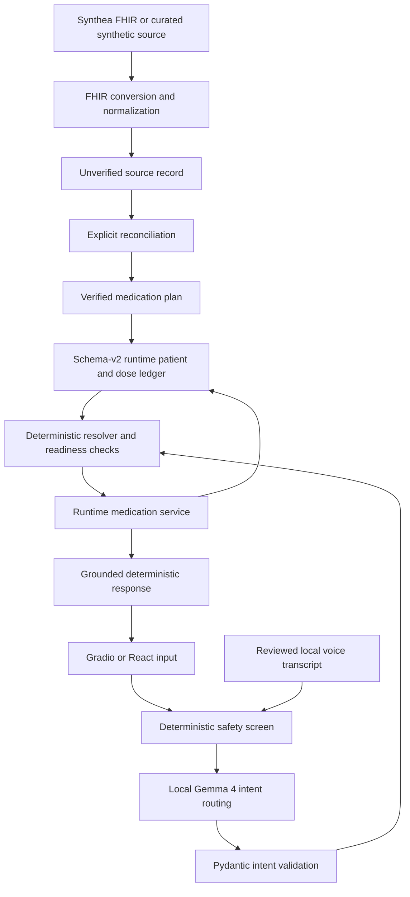

# Medication Copilot

Medication Copilot is a privacy-first, local medication-navigation and adherence-support prototype for older adults and caregivers. It presents a human-reconciled medication schedule, answers bounded questions about that schedule and its dose ledger, and records exact dose events through deterministic services.

It does **not** diagnose, prescribe, recommend treatment, check interactions, decide whether a late dose should be taken, or change dosages. The repository uses synthetic data and is not a medical device.

## Motivation

Managing several medicines makes it easy to lose track of names, schedules, and whether a dose was already recorded. Medication Copilot explores a narrow engineering approach: use local AI to make a verified record easier to navigate, while keeping medication facts, safety decisions, readiness, time calculations, and persistence outside the model.

## Architecture



Three data layers remain separate:

1. `source_record` preserves imported orders and provenance. FHIR `active` never means confirmed current use.
2. `medication_plan` contains explicitly reconciled medicines and verified schedules.
3. `dose_logs` contains only app-generated or explicitly simulated adherence events.

Gemma never supplies medication facts. Removing it removes natural-language routing and transcription convenience, but does not change schedules, readiness, allergy meaning, effective dose status, or persistence.

See [docs/architecture.md](docs/architecture.md) for request, voice, confirmation, and persistence flows.

## Technology stack

- Python 3.10+, FastAPI, Pydantic, HTTPX, and Uvicorn
- React, Vite, and TypeScript
- Gradio as the preserved canonical reference interface
- Gemma 4 E2B through local Ollama inference
- Local FFmpeg normalization for browser and uploaded audio
- JSON runtime storage with validated, atomic file replacement
- Pytest and Node-based frontend contract tests

## How Gemma 4 is used

Gemma 4 E2B runs locally through Ollama. For typed or approved transcript input, it maps language to a small action schema. Model JSON is validated by Pydantic, with one bounded repair attempt. Medication phrases are passed unchanged to the deterministic resolver.

Gemma is also the configured local speech-to-text provider. Audio is normalized locally and sent with a transcription-only instruction; the transcript is displayed for editing and must be submitted before routing. English is the only voice language currently tested. The model is not used for reconciliation, schedule generation, medication matching, safety decisions, dose-status calculation, or persistence.

## Implemented capabilities

- Ready and review-required synthetic patients
- Synthea FHIR conversion, conservative normalization, conflict detection, and explicit reconciliation
- Verified daily schedules, next-dose lookup, dose-status lookup, saved instructions, and history
- Canonical clock-derived `upcoming`, `due`, and `missed` presentation
- Exact, expiring missed-dose follow-up and idempotent mark-taken persistence
- Deterministic emergency and medication-advice refusals before model routing
- Verified medication-appearance text as an optional memory aid, never an identifier
- Accessible dashboard with large text, high contrast, simplified presentation, oversized controls, persistent chat, and repeat-last-answer
- Local record/upload → transcribe → review/edit → submit voice workflow
- Explicit confirmation for voice and exact missed-dose mutations
- React/FastAPI interface plus the preserved Gradio reference interface
- Source-record review, developer-only debug output, and structured health reporting

## Repository structure

```text
app.py                 CLI and Gradio entry point
backend/               FastAPI JSON platform adapter and session confirmations
frontend/              React/Vite/TypeScript application
config.py              environment-backed local settings
data/                  protected synthetic profiles, runtime patients, and evaluations
docs/                  architecture, roadmap, demo, and submission documents
evaluation/            local intent and voice evaluation assets
gemma/                 Ollama client, prompts, intent schemas, parser, and orchestrator
medication/            deterministic conversion, validation, repositories, and services
prompts/               completed phase implementation briefs retained as history
scripts/               FHIR conversion and deterministic demo lifecycle tools
tests/                 non-live Python regression suite
ui/                    preserved Gradio reference application
voice/                 audio validation, transcription provider, probe, and workflow
rules.md               permanent safety and data specification
writeup.md             Kaggle submission narrative
```

## Setup

```bash
python -m venv .venv
source .venv/bin/activate
python -m pip install --upgrade pip
python -m pip install -r requirements.txt
```

Install Ollama, start it locally, and pull the configured model:

```bash
ollama pull gemma4:e2b
```

`OLLAMA_BASE_URL`, `OLLAMA_MODEL`, and `OLLAMA_TIMEOUT_SECONDS` override model defaults. Deterministic data checks work without Ollama; natural-language routing and speech transcription do not.

Install frontend dependencies:

```bash
cd frontend
npm install
cd ..
```

## Prepare and verify the demo

```bash
python app.py reset-demo
python app.py verify-demo
python app.py verify-demo --require-model  # strict live-model verification
python app.py voice-health                 # separate live audio probe
```

For a reproducible scenario:

```bash
export DEMO_NOW="2026-08-01T10:00:00-04:00"
```

The timestamp must include an offset. `DOSE_DUE_WINDOW_MINUTES` defaults to `15`; `DOSE_MISSED_AFTER_MINUTES` defaults to `30`. These are display policies, not clinical guidance.

## Run the interfaces

React and FastAPI:

```bash
python -m backend
# second terminal
cd frontend
npm run dev
```

Open `http://127.0.0.1:5173`. Vite proxies `/api` to FastAPI on `127.0.0.1:8000`.

Preserved Gradio reference:

```bash
python app.py serve
```

Open `http://127.0.0.1:7860`. Neither interface enables public sharing.

Useful CLI commands:

```bash
python app.py list-patients
python app.py patient-status demo-ready-001
python app.py health
python app.py ask --patient demo-ready-001 "What medicine comes next?"
```

Run `python app.py --help` for conversion and reconciliation commands.

## Accessibility and voice workflow

Both interfaces keep the medication dashboard visible while the user interacts. The presentation supports large text, high contrast, simplified language, large controls, one-click deterministic actions, medication appearance descriptions, and repeat-last-answer. The React interface also provides a persistent, auto-scrolling chat panel.

Voice is not real-time chat. The user explicitly records or uploads up to 30 seconds of audio, the app converts it to mono 16 kHz PCM WAV in a temporary non-identifying directory, Gemma transcribes it locally, and the user reviews or edits the transcript before submission. State-changing transcripts display the exact medicine, strength, date, time, and proposed action before a second confirmation. Audio and pending transcript state are not written to runtime patient JSON. TTS is not implemented.

## Deterministic safety model

- The safety screen runs before Gemma and returns fixed refusals for treatment, interaction, dose-change, and emergency requests.
- Readiness is computed from verified plans, schedules, conflicts, and timezone data.
- The resolver searches only confirmed reconciled medicines and returns `MATCHED`, `AMBIGUOUS`, or `NOT_FOUND`.
- Effective dose status comes from one injected-clock function; time passage does not rewrite JSON.
- Mutations target one revalidated scheduled ledger entry and remain idempotent.
- Five-minute confirmations are session-, patient-, medication-, and dose-specific.
- Missing or conflicting information remains uncertain; the application never guesses.

## Privacy model

All included records are synthetic. Ollama, Gemma, runtime files, audio conversion, and the application servers run locally; no cloud inference or cloud speech fallback is configured. Model prompts exclude raw FHIR bundles, exact addresses, claims, sensitive social context, and unrelated clinical history. Audio is deleted after transcription, and raw audio bytes are excluded from runtime data and debug output.

## Testing

```bash
pytest -m "not integration"
python -m compileall -q app.py backend medication gemma ui scripts evaluation voice
cd frontend && npm test && npm run build
cd ..
python app.py reset-demo
python app.py verify-demo
git diff --check
```

Live model and audio probes are intentionally separate from the non-live suite.

## Limitations

- Synthetic demo data only; no clinical validation or production deployment
- No prescribing, diagnosis, interaction checking, treatment recommendations, or clinical adherence scoring
- English-only voice workflow as tested; model availability depends on the local Ollama/runtime combination
- No TTS, production reminders, image scanning, pill recognition, external drug lookup, hospital integration, or native mobile application
- Appearance descriptions are verified text aids and may vary by manufacturer or refill
- Local JSON persistence is suitable for a prototype, not multi-process production use

## Documentation

- [Permanent rules](rules.md)
- [Architecture](docs/architecture.md)
- [Roadmap](docs/roadmap.md)
- [Demo script](docs/demo_script.md)
- [Submission checklist](docs/submission_checklist.md)
- [Contributing](CONTRIBUTING.md)
- [Kaggle writeup](writeup.md)

## Future work

Future work is intentionally outside diagnosis and treatment: local TTS, human-verified image/document assistance, lower-latency local inference, native Android deployment, caregiver workflows, healthcare-system integration, and formal usability and clinical validation.
