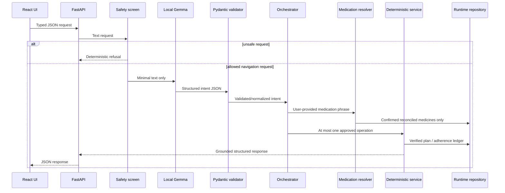

# Architecture

## System overview

Medication Copilot is a local text prototype with three strict data layers: an imported source record, an explicitly reconciled medication plan, and an adherence ledger. The local model interprets language but never supplies medication facts. Pydantic schemas and deterministic services enforce boundaries before any patient-facing response or mutation.

## Repository structure

```text
app.py                 CLI entry point
config.py              environment-backed local settings
data/                  protected synthetic profiles, runtime patients, and evaluation data
evaluation/            live intent-routing evaluation runner
gemma/                 Ollama client, prompt, intent schema, parser, and orchestrator
medication/            conversion, reconciliation, schemas, repositories, safety, and services
scripts/               Synthea converter and deterministic demo tooling
tests/                 non-live unit and integration-style regression tests
ui/                    local FastAPI presentation boundary
frontend/              React, TypeScript, and Vite interface
```

## Runtime request flow



Invalid model output receives one bounded repair attempt. Failed repair produces a no-action routing result. Medication-specific phrases are preserved for the deterministic resolver, which alone returns `MATCHED`, `AMBIGUOUS`, or `NOT_FOUND`.

## Source record and verified plan

`source_record.medications` preserves imported or curated source orders and provenance. FHIR `active` does not imply current use. These records are available only through the read-only review path.

`medication_plan.medications` is created by explicit reconciliation. Daily actions accept only confirmed, verified entries with verified schedules. PRN entries may be reconciled but cannot receive recurring reminders.

`dose_logs` contains only app events or explicitly seeded synthetic adherence events. Clinical `MedicationAdministration` records remain in `source_record.clinical_administrations` and are never merged automatically.

## Readiness enforcement

The deterministic readiness result requires a confirmed medication list, verified schedules, a valid timezone, and no blocking conflict affecting the plan. `RuntimeMedicationService.ensure_ready()` blocks schedule and adherence operations for an unready patient. Raw source orders cannot be used as a fallback.

## Safety boundaries

The deterministic safety screen runs before Gemma. Requests for diagnosis, interactions, medication changes, dose changes, missed-dose advice, or treatment receive a fixed refusal; emergency language receives escalation guidance. Gemma cannot override this result.

Gemma may classify a request, preserve a medication phrase, or request clarification. It may not resolve medications, create schedules, infer adherence, provide clinical advice, or mutate persistence directly.

## Persistence flow

Runtime patients are loaded through `PatientDataService`, which validates schema version 2.0 and cross-field invariants. Mark-taken updates are revalidated and written through a temporary file followed by atomic replacement. Duplicate marks update no additional ledger entry.

## Fixed clock

`SystemClock` uses each patient's IANA timezone. `FixedClock` accepts a timezone-aware ISO-8601 value supplied by `DEMO_NOW` or `--now`. The same clock controls today, next-dose, status, mutation timestamps, history filtering, CLI, API, and React behavior.

## Web interface boundary

The React application contains presentation state only. FastAPI returns patient summaries, readiness, schedule rows, next-dose data, progress totals, PRN entries, grounded action responses, and filtered source-review data. React does not calculate medication status or access runtime patient files.

State-changing requests address an exact scheduled dose ID and require an explicit confirmation payload. The runtime service revalidates patient readiness, dose ownership, confirmation-plan membership, and the active date before saving, then the API returns a freshly loaded dashboard.

## Demo-data generation and reset

`scripts/prepare_demo_data.py` builds the ready and unready patients from curated source objects and protected reconciliation profiles. It applies the existing reconciliation, plan, readiness, schedule-generation, and runtime-schema code.

`python app.py reset-demo` generates into a temporary sibling directory, validates the complete expected patient set, and atomically replaces the active runtime directory only after success. It never recreates raw Synthea output or the deleted converted-patient corpus.

## Verification and health

`python app.py verify-demo` validates protected assets, reconciliation profiles, expected patients, schemas, IDs, readiness states, schedules, dose references, timezones, and the active clock. It reports Ollama endpoint, reachability, configured model, model availability, and minimal generation separately. `--require-model` makes model failure fatal.

`python app.py health` is the lighter runtime health view used by the UI. It reports deterministic-data health independently from local-model health.

## Future insertion points

Voice and image input are not implemented. A future voice adapter may produce text before the existing safety/router boundary. A future image/document extractor must create an unverified candidate for human reconciliation; it must never write directly to the verified plan. Neither modality may bypass safety, schemas, readiness, resolution, or deterministic services.
